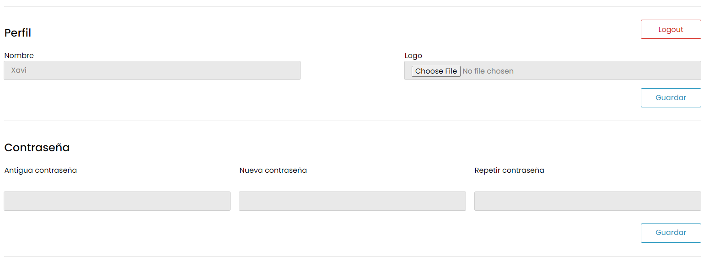

:toc: left

= Masterly

== 1. Introducción

Este trabajo está elaborado por los alumnos de segundo año de DAW del instituto Nicolau Copèrnic Xavi Carné y Oscar Alonso. 

Nuestra aplicación se llama Masterly será elaborada en lo que queda del curso de DAW2T. El propósito central de nuestro proyecto es la creación de una página web que sirva para comprar productos artesanales.

Para una buena navegación por la página web, se intentará crear un diseño cómodo, agradable y fácil de entender para todos usuarios que se conecten mediante una pantalla de ordenador convencional o un dispositivo móvil.

== 2. Seguimiento semanal

=== Semana 1

A lo largo de la primera semana, nos hemos encargado de realizar las tareas introductiorias del proyecto como son las siguientes:

* Creación del repositorio Gitlab y Kanban Trello (Samuel, Oscar y Xavi - 4h)
* Realización de la primera versión de la guia de estilos (Samuel, Oscar y Xavi - 6h)
* Diseño de la base de datos a partir de las tablas de "product" y "category" (Oscar y Xavi - 2h)
* Realización de scketchings, wireframe y mockups de la pantalla "home" en vista ordenador y mobil (Samuel y Oscar - 6h)

=== Semana 2

La segunda semana del proyecto es en la que hemos empezado a desarrollar la aplicación en Laravel. Las tareas más importantes de las que nos hemos encargado son las siguientes:

* Realización de scketchings, wireframe y mockups de la pantalla "home" en vista ordenador y mobil (Oscar y Xavi - 6h)
* Realizar los "seeders", "migrations" y "factories" de los modelos "Product" y "Category" (Xavi - 2h)
* Mostrar todos los datos de los productos en la página "home" (Xavi - 3h)
* Realización de la vista de la pantalla de producto (Oscar - 4h)

=== Semana 3

En la tercera semana, sobretodo hemos continuado implementando las funcionalidades de las pantallas de "home" y producto.

* Paginación del total de productos en la página home (Xavi - 3h)
* Filtración de productos a partir del nombre en una barra de búsqueda(Xavi - 4h)
* La página web redirige a la página de producto cuando se clica a un producto y se muestran los datos pertinentes (Oscar - 2h)
* Realización del logger (Samuel - 2h)
* Adición y eliminación de la id de los productos en el local storage y mostrarlos en el contador (Oscar - 4h)

=== Semana 4

La cuarta semana ha sido dedicada a terminar las funcionalidades de home y carrito. A la vez, se ha empezado la realización de las pantallas de login y registro.

* Realización de la vista de la pantalla de carrito (Oscar - 6h)
* Mostrar productos añadidos al carrito en la pantalla del carrito (Oscar - 8h)
* Refactorización del código storage listener y product fetcher (Oscar - 2h)
* Implementación categorias y subcategorias (Xavi - 12h)
* Adición de imágenes reales de la API unsplash (Xavi - 2h)
* Continuación de la implementación del logger (Samuel - 4h)
* Realización de la vista y la funcionalidad del login y registro (Samuel - 7h)

=== Semana 5

Esta semana, al haber dispuesto de únicamente 2 días de trabajo, no ha sido posible realizar tantos avances como en otras semanas. Aún así, hemos podido finalizar tareas pendientes de semanas anteriores.

* Obtención de productos y categorias reales y relación entre estos (Xavi | 5h previstas - 6h reales)
* Eliminación productos del carrito del html, modificación precio total y cantidad de productos (Oscar | 4h previstas - 6h reales)
* Cambio color icono carrito al añadir/eliminar producto al carrito desde home (Oscar | 1h prevista - 1h real)
* Enviación email de verificación (Samuel | 3h previstas - 5h reales)
* Implementación medidas rem (Oscar y Xavi | 1h prevista - 1h real)

=== Semana 6

* Relación productos aleatorios y tags (Xavi | 5h previstas - 4h reales)
* Implementación de la relación entre tiendas y productos (Xavi | 9h previstas - 9h reales)
* Almacenamiento productos del carrito en la base de datos (Oscar | 10h previstas - 12h reales)
* Productos añadidos al carrito desde la pantalla de producto (Oscar | 3h previstas - 4h reales)

=== Semana 7

* Lógica y diseño de las páginas de error (Xavi | 4h previstas - 4h reales)
* Creación página editar producto (Xavi | 8h previstas - 9h reales)
* Control del carrito en la base de datos al hacer logout (Oscar | 4h previstas - 5h reales)
* Imágen de perfil de usuario por defecto (Oscar | 1h previstas - 2h reales)
* Vista página perfil (Oscar | 3h previstas - 5h reales)

=== Semana 8

* Creación API imágenes (Oscar | 1h previstas - 2h reales)
* Funcionalidad página perfil (Oscar | 3h previstas - 5h reales)
* Seeder imágenes (Oscar | 2h previstas - 10h reales)
* Generación pedidos (Xavi | 10h previstas - 12h reales)

=== Semana 9

* Mostrar imágenes producto desde la API (Oscar | 5h previstas - 7h reales)
* Vista página creación producto (Oscar | 2h previstas - 3h reales)
* Implementación chat y notificaciones (Xavi | 6h previstas - 7h reales)
* Aceptar y denegar pedido (Xavi | 2h previstas - 2h reales)

=== Semana 10

* Creación productos con peticiones a la API (Oscar | 6h previstas - 12h reales)
* Impresión pedido en formato PDF (Oscar | 2h previstas - 2h reales)
* Configuración vagrant en los dos proyectos (Xavi | 5h previstas - 8h reales)
* Creación tests (Xavi | 5h previstas - 8h reales)
* Mejoras finales (Oscar y Xavi | 2h previstas - 2h reales)

== 3. Diseño de Base de Datos

A continuación, se muestra un diagrama en el que se muestra las tablas utilizadas en la aplicación y las relaciones entre ellas.

== 4. Guia de estilos

* https://www.figma.com/file/Oyx955CXRMUT6qIHY3sstl/Masterly?type=design&node-id=0%3A1&t=6IU4oE5tTAsTfiDe-1[Guia de estilos]

== 5. Diseño de pantallas

=== 5.1 Sketchings

==== Landing

==== Home

==== Detalle producto

==== Cart

==== Editar producto

==== Detalle home mobile

==== Detalle producto mobile

=== 5.2 Wireframes i Mockups

* https://www.figma.com/file/Oyx955CXRMUT6qIHY3sstl/Masterly?type=design&node-id=1%3A1847&t=RqKqRvqM1sNRmURE-1[Wireframes i Mockups]

== 6. Manual de instalación/distribución

Dispones de dos maneras con las que poder utilizar la aplicación Masterly, mediante tu máquina local o mediante la utilización de entornos Vagrant. (Ambos manuales asumen que has clonado los proyectos Masterly y APImasterly en tu máquina local y que tienes tanto el vagrant como el composer instalados. En caso de no tenerlos, a continuación se listan los enlaces necesarios).

* https://github.com/Xavii22/Masterly[Repositorio Masterly]
* https://github.com/oalonsoo/APIMasterly[Repositorio APIMasterly]
* https://developer.hashicorp.com/vagrant/downloads?product_intent=vagrant[Vagrant]
* https://getcomposer.org/download/[Composer]

=== 6.1 Instalación local

Para instalar las aplicaciones Masterly y APIMasterly en tu máquina local, debes seguir los siguientes pasos:

1 . Primeramente, necesitarás crear el fichero ".env" de los dos proyectos. Para hacer eso, partiendo de la raiz de cada proyecto, dirígete al directorio /src y realiza una copia del archivo llamado ".env.example". Ponle ".env" como nombre a esa copia en los dos casos. Asegúrate de que, al final del archivo ".env" del proyecto Masterly, se encuentran las variables definidas en el archivo ".env.config". En caso de que no se encuentren, copia estas al final del archivo ".env" de Masterly.

2 . Una vez tengas los archivos ".env" en ambos proyectos, deberás modificar los valores de la configuración de la base de datos en el mismo archivo para ajustarse a los valores de tu propia base de datos. Tanto en el proyecto Masterly como en el proyecto APIMasterly, deberás poner como valor "localhost" en la variable "DB_HOST" y tus propias credenciales para conectarte a la base de datos. En caso de no tener la base de datos creada, ejecuta este comando desde una terminal MySQL o un gestor de bases de datos como MySQL Workbench o DBeaver.

`CREATE DATABASE IF NOT EXISTS masterly CHARACTER SET utf8mb4 COLLATE utf8mb4_unicode_ci;`

3 . El siguiente paso consiste en ejecutar el composer de la aplicación Masterly. Para ello, dirígete al directorio /src partiendo de la raiz del proyecto Masterly y ejecuta el siguiente comando en una terminal

`composer install`

4 . Realiza el mismo proceso para la aplicación APIMasterly.

5 . A continuación, dirígete otra vez al directorio /src del proyecto Masterly y ejecuta el siguiente comando para ejecutar la aplicación.

`php artisan serve`

6 . Otra vez, realiza el mismo proceso para la aplicación APIMasterly pero cambiando el puerto de ejecución a un puerto distinto.

`php artisan serve --port=8080`

7 . Vuelve al directorio /src del proyecto Masterly y ejecuta los migrations de la siguiente manera.

`php artisan migrate`

8 . Al finalizar la anterior migración, ejecuta también la migración del proyecto APIMasterly.

9 . Finalmente, vuelve al directorio /src del proyecto Masterly y ejecuta los migrations de la siguiente manera.

`php artisan db:seed`

10 . Si todo se ha ejecutado correctamente, ya puedes visitar la aplicacón Masterly desde la siguiente dirección.

http://localhost:8000

=== 6.2 Instalación Vagrant

Para instalar la aplicaciones Masterly y APIMasterly en su propio entorno de Vagrant respectivamente, debes seguir los siguientes pasos:

1 . Al igual que en la instalación el la máquina local, necesitarás crear el fichero ".env" de los dos proyectos. Para hacer eso, partiendo de la raiz de cada proyecto, dirígete al directorio /src y realiza una copia del archivo llamado ".env.example". Ponle ".env" como nombre a esa copia en los dos casos. Asegúrate de que, al final del archivo ".env" del proyecto Masterly, se encuentran las variables definidas en el archivo ".env.config". En caso de que no se encuentren, copia estas al final del archivo ".env" de Masterly.

2 . Una vez tengas los archivos ".env" en ambos proyectos, deberás modificar los valores de la configuración de la base de datos en el mismo archivo para ajustarse a los valores de tu propia base de datos. En el caso del proyecto Masterly, deberás poner como valor "localhost" en la variable "DB_HOST". En cambio, en el caso del proyecto "APIMasterly", deberás de poner la dirección IP de la aplicación en la variable "DB_HOST". En ambos archivos, debes de introducir el valor Masterly en la variable "DB_DATABASE", el valor "root" en la variable "DB_USERNAME" y el valor "secret" en la variable DB_PASSWORD.

3 . El siguiente paso consiste en ejecutar el archivo "Vagrantfile". Para hacer eso, desde una terminal, dirígete al directorio "/vagrant" del proyecto Masterly, el cual se encuentra en la raiz del proyecto. Una vez dentro, ejecuta el siguiente comando, el cual se encarga de crear el entorno vagrant y ejecutar la aplicación. 

`vagrant up`

4 . Una vez en la terminal muestre el mensaje "INFO  Server running on [http://_ip:puerto_]", ejecuta el mismo comando desde el directorio /vagrant del proyecto APIMasterly.

5 . Cuando haya acabado la ejecución del comando anterior, ejecuta los seeders del proyecto Masterly. Para hacer eso, desde una terminal y asegurándote que ambas aplicaciones, dirígete al directorio /vagrant del proyecto Masterly y ejecuta el siguiente comando.

`vagrant ssh -c "cd /var/www/html/masterly/src && php artisan db:seed"`

6 . A continuación, ejecuta el siguiente comando en el directorio /vagrant de ambos proyectos.

`vagrant ssh -c "cd /var/www/html/masterly/src && sudo php artisan storage:link"`

7 . Finalmente, con el fin de poder utilizar la página desde el navegador de tu máquina local Windows, deberás de dirigirte al siguiente archivo "C:\Windows\System32\drivers\etc\hosts". Una vez dentro del archivo, introduce la dirección IP y dominio utilizados en ambos proyectos de la siguiente manera.

8 . Una vez realizados estos pasos, al introducir la url "botiga.com" en un navegador, deberia de mostrarse la aplicación Masterly.

== 7. Manual de usuario

Manual de Usuario - Marketplace "Masterly"

Introducción y Descripción General:
El Marketplace "Masterly" es una plataforma en línea que te permite descubrir y comprar una amplia variedad de productos artesanales. La página principal cuenta con una landing page donde se muestran productos agrupados por tags, los cuales pueden dependiendo de la época del año.

image::images/demolanding.png[width=800, align=center, alt=Landing]

* *Introducción:* Para comenzar, dirígete al header de la página y haz clic en el botón "Login" para iniciar sesión.

* *Registro y login:* Si no tienes una cuenta, selecciona la opción "Registrarse" y completa los datos requeridos para crear tu cuenta en "Masterly".
Una vez registrado, podrás utilizar tus credenciales para hacer login en futuras visitas.

* *Perfil de usario:* Una vez que hayas iniciado sesión, el botón que antes iba a la pantalla de login ahora te llevará a tu perfil de usuario.
En el perfil, puedes visualizar y editar tus datos personales.
También tendrás la opción de crear tu propia tienda dentro de "Masterly", si deseas vender tus propios productos, más sobre eso más adelante.

* *Página home:* Al acceder a la página home después de iniciar sesión, podrás ver una lista de productos disponibles.
Utiliza las opciones de ordenación disponibles para clasificar los productos por reciente, precio y orden alfabético, según tus preferencias.
También puedes agrupar los productos por categorias y subcategorias, con el fin de encontrar un tipo de producto más específico.
Incluso puedes escribir en la barra de búsqueda localizada en el header para buscar productos en concreto por su nombre.

* *Detalle del producto:* Al hacer clic en un producto específico, se abrirá la pantalla de detalle del producto.
Aquí encontrarás información detallada sobre el producto, como descripción, precio y imágenes.
Si deseas comprar el producto, podrás agregarlo al carrito desde esta pantalla o desde la de home.

* *Realización de pedidos:* Una vez que hayas agregado productos al carrito, puedes acceder desde el icono del carrito en el header.
Dentro del carrito, podrás revisar los productos seleccionados y eliminar artículos si es necesario.
Cuando estés listo para finalizar tu compra, selecciona la opción "Realizar Pedido".

* *Notificaciones y chat:* Después de realizar un pedido, recibirás una notificación en tu pantalla de perfil.
En tu perfil, encontrarás un chat donde puedes comunicarte directamente con el vendedor para cualquier consulta o duda relacionada con tu pedido.

* *Creación de Tienda:* Desde la pantalla de perfil, los usuarios pueden crear su propia tienda dentro de "Masterly".
Para crear una tienda, introduce un nombre y carga un logo representativo.

* *Administración de Productos:* Una vez que hayas creado tu tienda, se mostrará un botón en tu perfil que te llevará a una pantalla dedicada a administrar tus productos.
En esta pantalla, podrás ver una lista de los productos que has agregado a tu tienda.

* *Creación de Productos:* Dentro de la pantalla de administración de productos, encontrarás un botón con un símbolo de "+".
Al hacer clic en este botón, serás redirigido a la pantalla de creación de productos, donde podrás ingresar la información requerida para agregar un nuevo producto.
Completa los campos obligatorios, como el nombre y la subcategoría del producto, y carga las imágenes correspondientes. Además, podrás seleccionar si el producto debe ser destacado y si está habilitado para la venta.
Una vez que hayas creado el producto, se te redirigirá automáticamente a la pantalla de administración de productos, donde podrás ver el producto recién creado en la lista. Si necesitas editar los datos del producto, simplemente haz clic en el botón con forma de lápiz situado en la parte superior izquierda del producto.

== 8. Conclusiones

Tras 3 meses dedicados a la creación del proyecto Masterly, estas son las conclusiones que hemos sacado del mismo:

* El proyecto Masterly ha sido implementado utilizando tecnologías como Laravel, SCSS y JavaScript, permitiendo la creación de un Marketplace funcional y de alto rendimiento. La combinación de estas herramientas ha facilitado el desarrollo de un sistema robusto y escalable.

* Además de la plataforma del Marketplace, se ha desarrollado una API utilizando Laravel. Esta API ha sido diseñada para gestionar el almacenamiento de imágenes de los productos en el sistema de almacenamiento 

* Durante el desarrollo del proyecto, se ha prestado especial atención a la seguridad. Las tecnologías utilizadas, como Laravel, proporcionan una capa adicional de seguridad mediante la implementación de medidas de protección contra ataques comunes, como inyecciones SQL y ataques de cross-site scripting (XSS).

* Por otra parte, el hecho de haber sido limitados a únicamente 2 miebros de equipo nos ha complicado el hecho de poder finalizar todos los requisitos pedidos, por lo que se ha acabado recortando los puntos recientemente mencionados.

En resumen, el proyecto Masterly ha logrado implementar con éxito una plataforma robusta y escalable utilizando Laravel, SCSS y JavaScript. La integración de una API adicional ha permitido una gestión eficiente de las imágenes de los productos, mientras que el enfoque en la seguridad han mejorado la calidad general del Marketplace.

== 9. Líneas futuras

Líneas futuras para el proyecto Marketplace "Masterly":

* Una de los puntos a mejorar seria la implementación de un gestor de stock para los productos logrando una mejor experiencia de uso tanto para el cliente como para el vendedor.

* Una posible mejora en el proyecto sería implementar la capacidad de que los usuarios puedan restablecer sus contraseñas en caso de olvido o bloqueo de acceso. Esto proporcionaría una funcionalidad adicional de seguridad y conveniencia para los usuarios. Esta es una de las funcionalidades que no se ha llevado a cabo por el hecho de acabar siendo únicamente 2 miembros en el equipo.

* Se puede trabajar en la implementación de mensajes de error más descriptivos y comprensibles, que indiquen claramente el motivo del error y proporcionen posibles soluciones o pasos a seguir.

* Realizar la integración de más características y elementos interactivos utilizando JavaScript para mejorar la experiencia de usuario y lograr un diseño más dinámico. Esto podría incluir animaciones, transiciones suaves, carga de contenido asincrónico y otras funcionalidades que enriquezcan la interacción con el Marketplace.

* Para fomentar la confianza y la interacción entre compradores y vendedores, se podría desarrollar un sistema de valoraciones y reseñas en el Marketplace. Esto permitiría a los usuarios calificar y dejar comentarios sobre los productos y servicios adquiridos, brindando información útil a otros usuarios.
